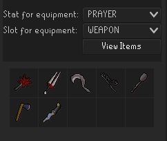

# Bank Equipment Stat Filter
Adds a panel to runelite to search your bank for items in a slot sorted by a stat.

Forget what your best magic attack bonus helmet is? This plugin will show you all of the
items in your bank for a particular slot that gives the bonus from highest to lowest, so you
can quickly tell which one you want to use.

# Usage
Open up the panel with this icon

, and then use the drop downs to select the stat and slot you want to search for. After selecting
your values, press "View Items" and it will show you all the items in your bank with a positive
value in that stat and slot, sorted from highest to lowest. You can hover over an item to see
its name and value for the selected stat

You must open your bank once for the plugin to work. After you have opened your bank once,
the plugin will be usable regardless of whether the bank is open, including if you log out.
The bank will be saved as long as runelite remains open.

# Things to Note
This plugin does NOT necessarily tell you the best item to use, it simply sorts by stat.
It does not for example take into account set bonuses, or attack speed of a weapons.

If you log into a different OSRS account, then the plugin will continue to show items
from the old accounts bank until you open the bank again on the new account.

Placeholders in your bank will be included in the results.